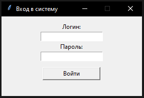
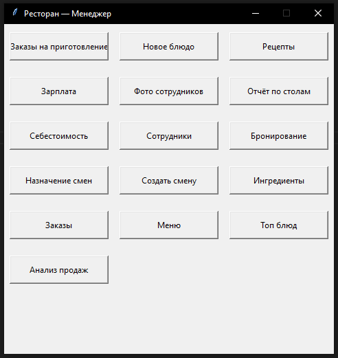
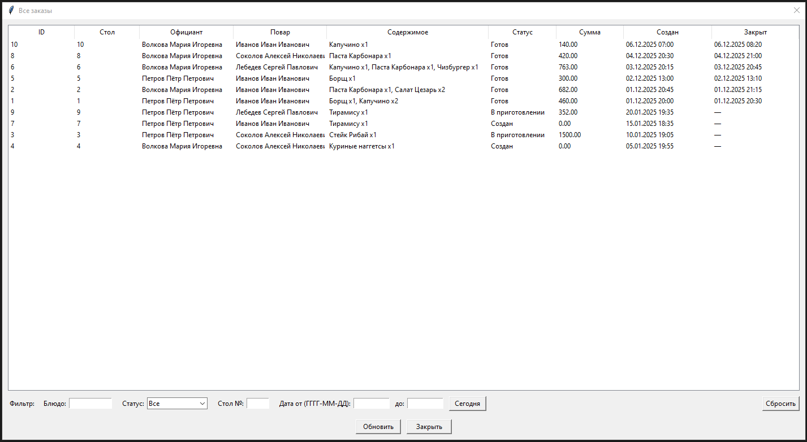
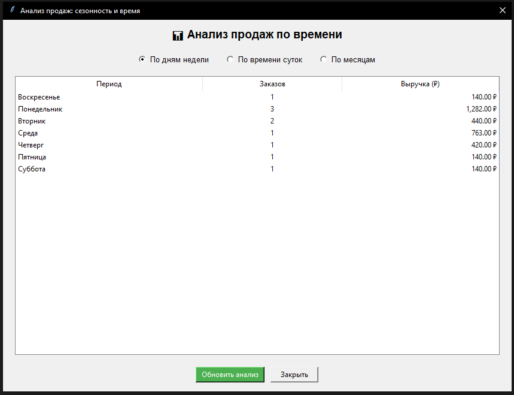
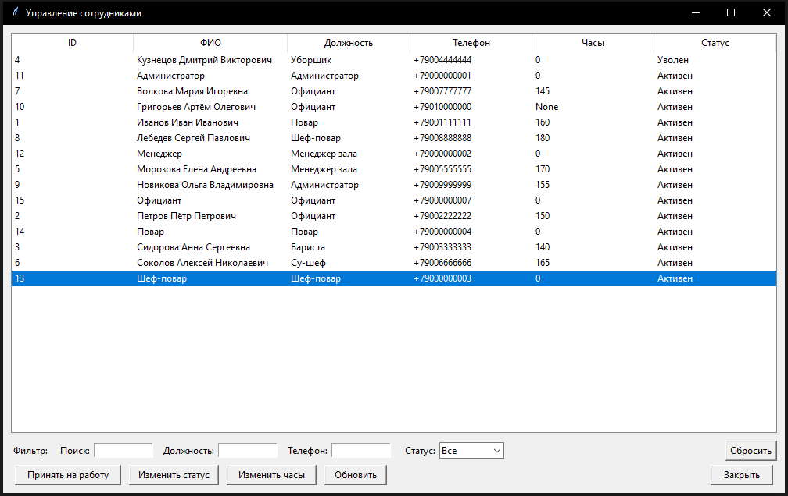

# Система управления рестораном с базой данных PostgreSQL и GUI на Python

[](https://python.org)
[](https://postgresql.org)

## 📋 Описание
**RestaurantManager** — это полноценная система автоматизации работы ресторана, разработанная в рамках учебной дисциплины «Базы данных». Приложение позволяет комплексно управлять заказами, персоналом, складом ингредиентов, бронированием столов и аналитикой продаж.

## ✨ Основные возможности
* **📊 Управление заказами** — создание, отслеживание статуса, история.
* **👨‍🍳 Кухня** — контроль приготовления блюд, автоматический учет ингредиентов.
* **👥 Персонал** — управление сотрудниками, сменами, расчет заработной платы.
* **🪑 Бронирование** — интерактивная система резервирования столов.
* **📈 Аналитика** — отчеты по продажам, популярные блюда, динамика выручки.
* **🧾 Чеки** — автоматическая генерация PDF-чеков для клиентов.
* **📦 Склад** — учет остатков ингредиентов, сроков годности, поставок.

## 🖼️ Скриншоты
### Меню авторизации

### Главное меню со всеми функциями (роль менеджера)


### Управление заказами


### Аналитика продаж


### Управление сотрудниками


## 🚀 Установка

### Требования
* Python 3.8 или выше
* PostgreSQL 12 или выше
* Git

### Пошаговая инструкция

1. **Клонируйте репозиторий:**
   ```bash
   git clone https://github.com/yourusername/RestaurantManager.git
   cd RestaurantManager
   ```

2. **Создайте базу данных PostgreSQL:**
   ```sql
   CREATE DATABASE restaurant_db;
   ```

3. **Выполните SQL-скрипт создания таблиц:**
   ```bash
   psql -U postgres -d restaurant_db -f database.sql
   ```

4. **Настройте подключение к БД:**
   Откройте файл `config.py` и укажите ваши параметры подключения:
   ```python
   DB_CONFIG = {
       "host": "localhost",
       "database": "restaurant_db",
       "user": "postgres",
       "password": "your_password"
   }
   ```

5. **Установите зависимости:**
   ```bash
   pip install -r requirements.txt
   ```

6. **Запустите приложение:**
   ```bash
   python main.py
   ```

## 📚 Использование

### Вход в систему
При первом запуске используйте учетные данные сотрудника, созданного в базе данных при импорте скрипта:
* **Логин:** номер телефона сотрудника
* **Пароль:** установленный при создании

### Роли пользователей
* **Администратор / Менеджер** — полный доступ ко всем функциям системы и отчетам.
* **Повар** — управление заказами на кухне, контроль остатков ингредиентов.
* **Официант** — создание новых заказов, бронирование столов, просмотр меню.

## 🏗️ Структура проекта
```text
RestaurantManager/
├── forms/                      # Модули интерфейса (GUI)
│   ├── all_orders.py           # Все заказы
│   ├── cook_orders.py          # Заказы для кухни
│   ├── employee_management.py  # Управление кадрами
│   ├── new_dish.py             # Создание блюд
│   ├── report.py               # Отчеты и аналитика
│   └── salary.py               # Расчет зарплаты
├── screenshots/                # Иллюстрации интерфейса для README
├── config.py                   # Конфигурация подключения к БД
├── db.py                       # Логика работы с базой данных
├── main.py                     # Точка входа в приложение
├── requirements.txt            # Зависимости проекта
├── database.sql                # SQL-схема БД и начальные данные
└── README.md                   # Документация проекта
```

## 🛠️ Технологический стек
* **Backend:** Python 3.8+
* **GUI:** Tkinter, ttk
* **Database:** PostgreSQL 12+
* **Libraries:**
  * `psycopg2` — драйвер для подключения к PostgreSQL
  * `reportlab` — генерация PDF-документов и чеков
  * `pillow` — обработка и отображение графических изображений
  * `tkcalendar` — графический виджет календаря
  * `babel` — интернационализация и локализация

## 📊 Схема базы данных
Основные сущности и таблицы:
* `Employee` — личные данные сотрудников
* `Post` — должности и тарифные ставки
* `Shift` — рабочие смены
* `TableInfo` — информация о столах в зале
* `Orderr` — заголовки заказов
* `Order_item` — позиции внутри заказов
* `Dish` — позиции меню (блюда)
* `Recipe` — рецептура блюд (состав)
* `Ingredient` — складской учет продуктов

## 🎓 Учебный проект
Проект разработан в рамках академического курса «Базы данных» и демонстрирует:
* Проектирование реляционной базы данных (ER-диаграммы).
* Нормализацию данных до 3НФ.
* Создание хранимых процедур, функций и триггеров.
* Работу с ACID-транзакциями на уровне приложения.
* Разработку полноценного клиент-серверного десктопного приложения.

## 👨‍💻 Автор
* **Булатов Илья**
* GitHub: [@yourusername](https://github.com/sqv1zyy)

---
*Made with ❤️ using Python & PostgreSQL*

⭐ **Если вам понравился проект, поставьте звезду на GitHub!**
